```r
library(pacman)
p_load(data.table, ggplot2, RSQLite)

chem_gen_db <- dbConnect(RSQLite::SQLite(), "../chem_gen.db")
Experiments <- data.table(dbReadTable(chem_gen_db, "Experiments"))
Ryan_Strains <- data.table(dbReadTable(chem_gen_db, "Ryan_Strains"))
dbDisconnect(chem_gen_db)

today <- "2022-03-24"

Experiments <- Ryan_Strains[Experiments[Date == today], on = .(Organism)]

for (i in unique(Experiments[!is.na(Species), Species])) {
  for (j in unique(Experiments$Remark)){

  this.plot <- 
    ggplot(
      Experiments[
        Species == i & j == Remark, 
        .(OD600,
          IPTG_mM = paste(Induced, Media)), 
        by = .(Time)],
      aes(x = Time, y = OD600, color = IPTG_mM, fill = IPTG_mM)) +
    ylim(0, max(Experiments$OD600)) +
    geom_smooth(formula = y ~ s(x, bs = "cs"), method = "gam") +
    scale_colour_brewer(palette = "Set1") +
    scale_fill_brewer(palette = "Set1") +
    ggtitle(paste(i, j, "growth curves on", today))
  
  plot(this.plot)
  }
}
```

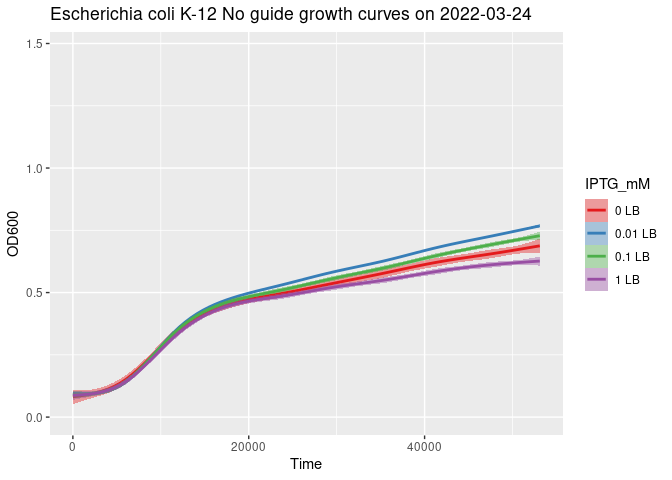<!-- -->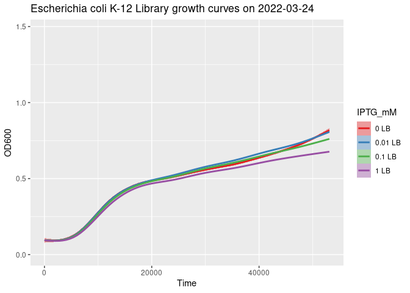<!-- -->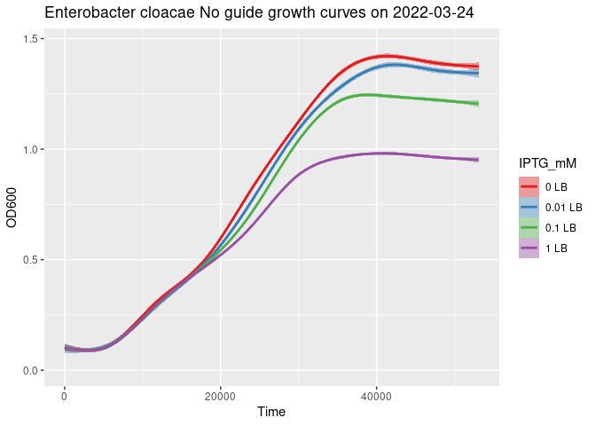<!-- -->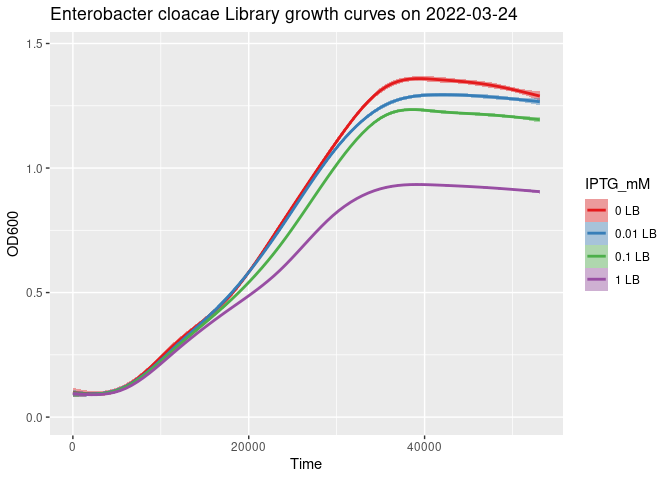<!-- -->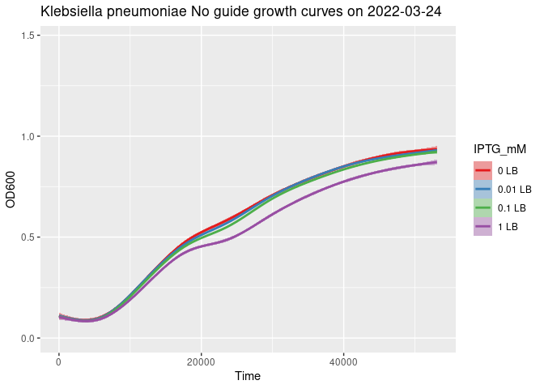<!-- -->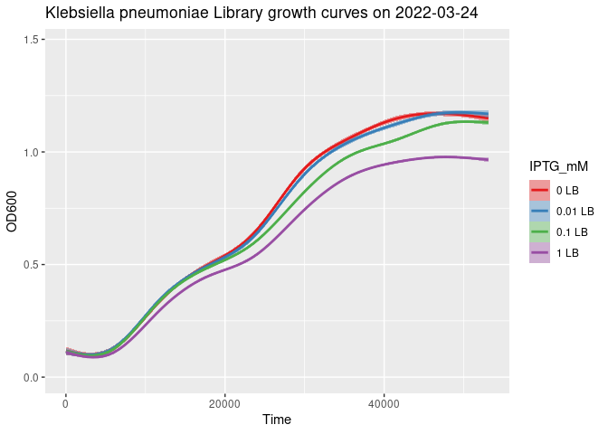<!-- -->

```r
library(pacman)
p_load(data.table, ggplot2, RSQLite)

chem_gen_db <- dbConnect(RSQLite::SQLite(), "../chem_gen.db")
Fitted_Experiments <- data.table(dbReadTable(chem_gen_db, "Fitted_Experiments"))
Ryan_Strains <- data.table(dbReadTable(chem_gen_db, "Ryan_Strains"))
dbDisconnect(chem_gen_db)

today <- "2022-03-24"

Fitted_Experiments <- Ryan_Strains[Fitted_Experiments[Date == today], on = .(Organism)]

for (i in unique(Fitted_Experiments[!is.na(Species), Species])) {
  for (j in unique(Fitted_Experiments$Remark)){

    this.plot <- 
      ggplot(
        Fitted_Experiments[
          Species == i & Remark == j, 
          .(OD600_fit,
            IPTG_mM = paste(Induced, Media)), 
          by = .(Hour)],
        aes(x = Hour, y = OD600_fit, color = IPTG_mM, fill = IPTG_mM)) +
      ylim(0, max(Fitted_Experiments$OD600)) +
      geom_smooth(formula = y ~ s(x, bs = "cs"), method = "gam") +
      scale_colour_brewer(palette = "Set1") +
      scale_fill_brewer(palette = "Set1") +
      ggtitle(paste(i, j, "FITTED growth curves on", today))
    
    plot(this.plot)
  }
}
```

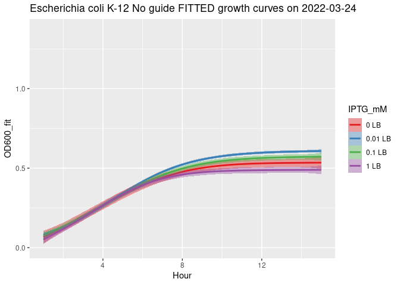<!-- -->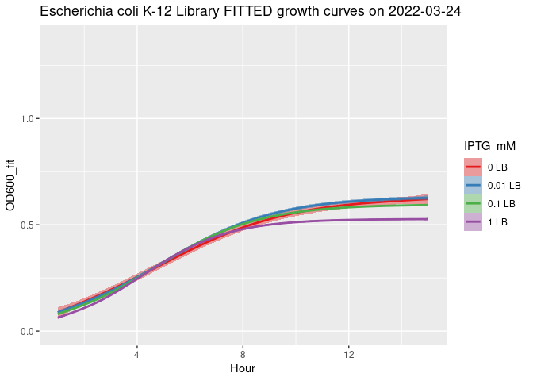<!-- -->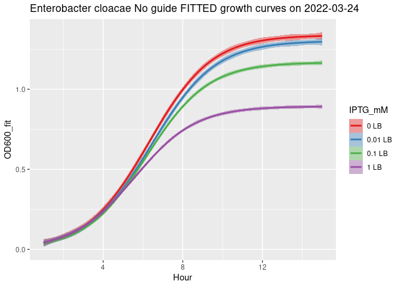<!-- -->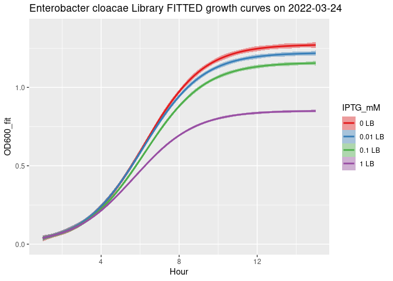<!-- -->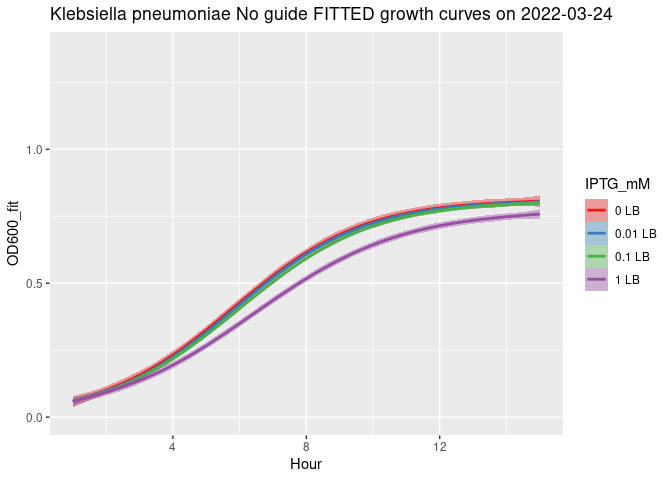<!-- --><!-- -->
